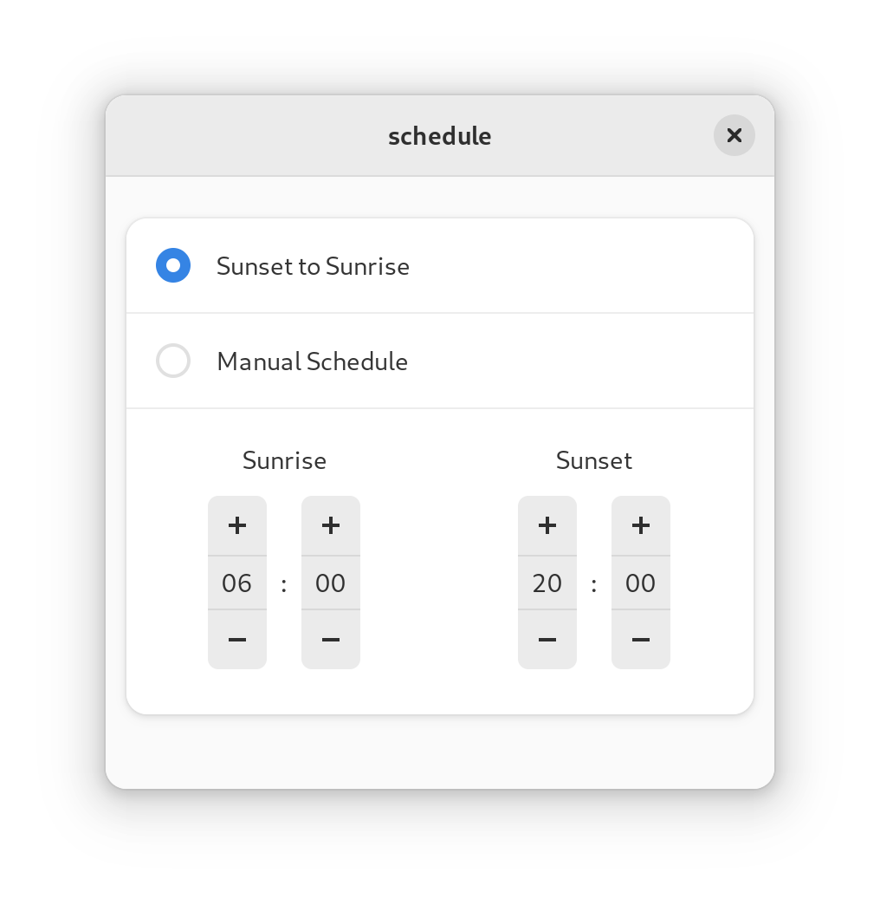
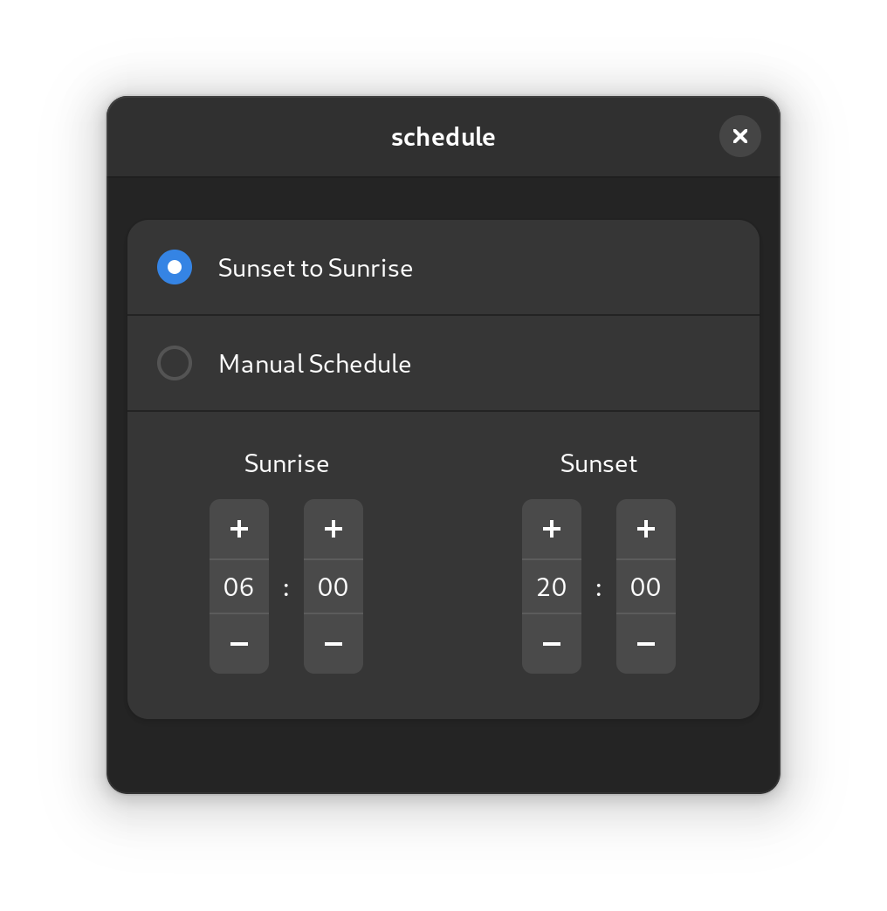

<!--
SPDX-FileCopyrightText: 2021 Romain Vigier <contact AT romainvigier.fr>
SPDX-License-Identifier: CC-BY-SA-4.0
-->

# schedule <!-- omit in toc -->

- fork of [@rmnvgr's](https://gitlab.com/rmnvgr) [`Night Theme Switcher`](https://gitlab.com/rmnvgr/nightthemeswitcher-gnome-shell-extension) for zarya's session

## screenshots:
| light | dark |
|  |  |

Automatically toggle your desktop’s color scheme between light and dark at sunset and sunrise.

---

## Table of contents <!-- omit in toc -->

- [Command line installation](#command-line-installation)
- [Contributing](#contributing)
- [Frequently asked questions](#frequently-asked-questions)

---
## Command line installation

You will need these tools:

- `meson`
- `gettext`
- `glib-compile-schemas`
- `glib-compile-resources`

Clone the repository and enter the directory:

```bash
git clone https://github.com./zarya-os/schedule.git && cd schedule
```

Build and install using `meson`:

```bash
# System-wide installation
meson setup builddir && meson install -C builddir

# User installation
meson setup builddir --prefix=~/.local && meson install -C builddir
```

Restart your GNOME session and enable the extension:

```bash
gnome-extensions enable schedule@zarya.com
```

## Contributing

You're welcome to contribute to the code or the translations! See [CONTRIBUTING.md](./CONTRIBUTING.md).

## Frequently asked questions

### Some applications don't switch their appearance

Like GNOME's built-in dark mode, the extension switches the standard freedesktop.org color scheme preference. Older applications might not follow this preference.

It is possible to force a GTK theme in the extension preferences, but please note that this can visually break applications. It is better to ask the developers of the applications to support the standard preference.

### Something doesn't work on Ubuntu

Unfortunately, Ubuntu ships heavily modified GNOME components to implement some of its features, like accent colors. Because it does so in a very hacky way instead of working with upstream and other desktop projects on a proper solution, it conflicts with anything that deals with the color scheme and themes, and results in a broken experience with the extension.

As the issue is in Ubuntu, and because I don't have the energy nor the will to work around the consequences of their decisions, unfortunately Ubuntu is not supported until it provides a standard GNOME environment.

### Switching happens too early/too late

There's a hidden setting to configure the offset (in hours) applied to the calculated sunrise and sunset times, you can change it with the `gsettings` command:

```
gsettings --schemadir ~/.local/share/gnome-shell/extensions/schedule@zarya.com/schemas/ set org.gnome.shell.extensions.nightthemeswitcher.time offset $DESIRED_OFFSET
```

### I have disabled Location services but want to use sunrise and sunset times from my location

If you know your coordinates, you can enter them in a hidden setting, and the extension will use them to calculate the sunrise and sunset times. You can set it with the `gsettings` command:

```
gsettings --schemadir ~/.local/share/gnome-shell/extensions/schedule@zarya.com/schemas/ set org.gnome.shell.extensions.nightthemeswitcher.time location '($LATITUDE,$LONGITUDE)'
```
